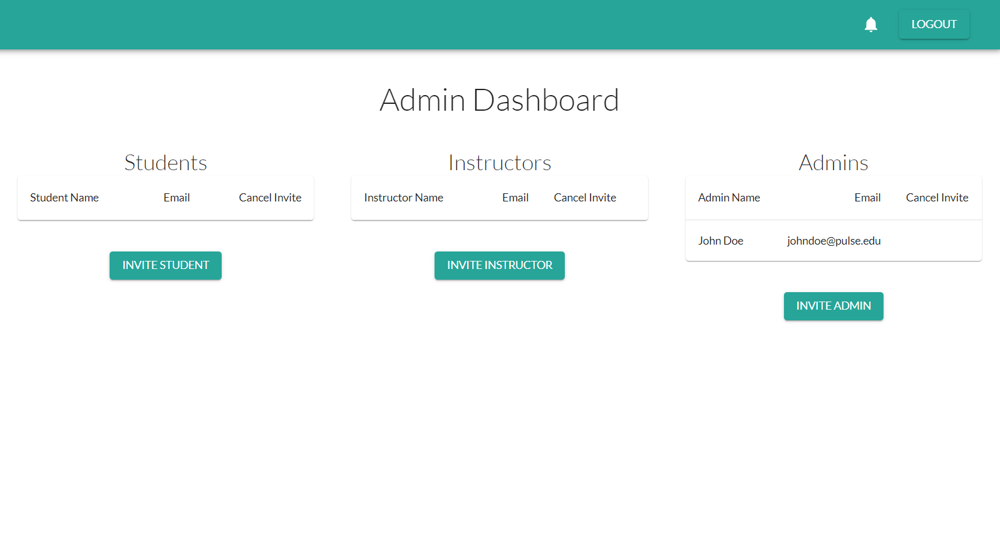
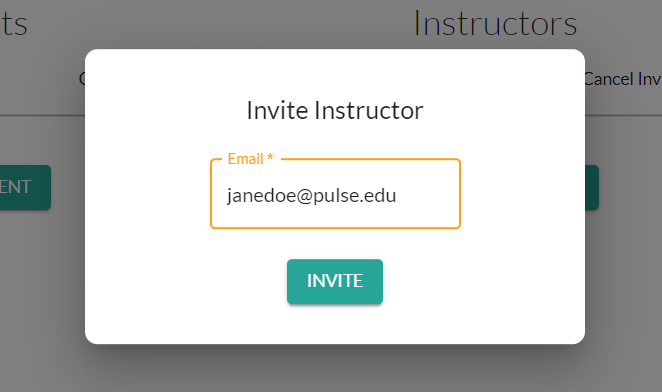
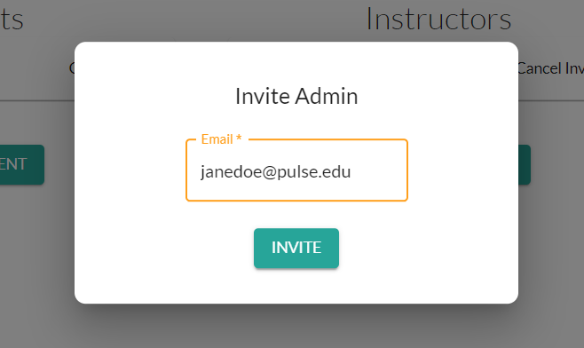

# Adding Students, Instructors, and Admins to Your School

---

In this Guide:
  - **Adding Students**
  - **Adding Instructors**
  - **Adding Other Admins**

---

*Any Admin can add other Students, Instructors, or other Admins to their School.*

Login to your Admin account and navigate to your **Dashboard**.

---

## Adding Students

To add Students to a School:
1. Click **Invite Student** on the **Admin Dashboard**.

2. Enter the their **School/Work Email**.
3. Click **Invite**.

## Adding Instructors

To add Students to a School:
1. Click **Invite Instructor** on the **Admin Dashboard**.

2. Enter the their **School/Work Email**.
3. Click **Invite**.

## Adding Other Admins

To add other Admins to a School:
1. Click **Invite Admin** on the **Admin Dashboard**.

2. Enter the their **School/Work Email**.
3. Click **Invite**.
