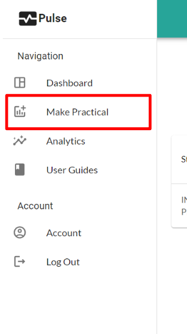
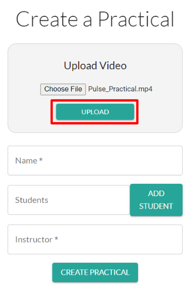
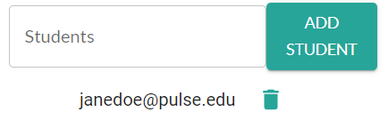

# Making a Practical (Admin)

---

*Any Admin or Instructor of a school can make a Practical. This page is for making a Practical as an Admin.  For Instructors follow this: **[Making a Practical (Instructor)](/user_guides/instructor/make_practical/)***

To Make a Practical:

1. Login to your Admin account and navigate to **Make Practical** on the sidebar.

2. **Upload your video**. Click *Choose File*, then select your video on your computer. Then click **Upload**.
>Video must be .mp4 format and less than 500mb

3. Enter the **Name** of the Practical.
   
4. *(optional)* Enter the school/work email of a student into the **Students** box. 
   
   
   
   Then click **Add Student**. This will display that student's email below. 

   
   Repeat this for all students you want to add to your Practical. 

   Instructors can always add and remove students from a Practical on their Dashboard.

5. Enter the Intructor's school/work email.
6. Click **Create Practical**