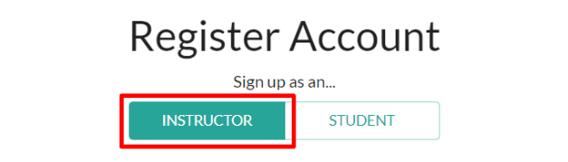
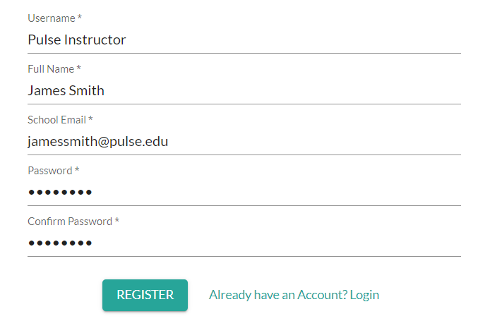

# Register Account (Instructor)

---

>To register an account as an Instructor, an admin at your school must first invite your school/work email to your school. See **[Adding Students, Instructors, and Admins to Your School](/user_guides/admin/add_users/admin_add_users.md)** for more.

From the Home Page navigate to "Register User" or follow this link: https://the-pulse-app.com/register_user.

---

1. Select "sign up as an..." **Instructor**
{width="80%}

1. Enter your **Username**.
2. Enter your **Full Name**.
3. Enter your **Work/School Email Address**
4. Enter and confirm your **Password**
{width="80%}
1. Click **Register**

