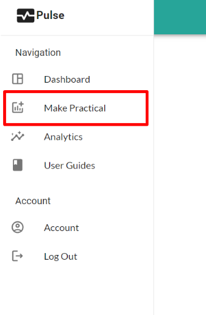
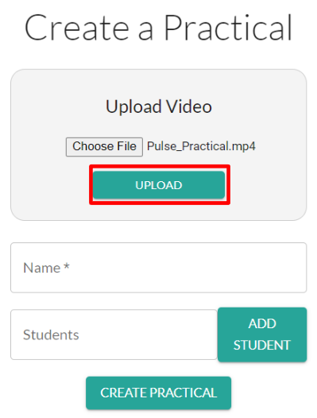
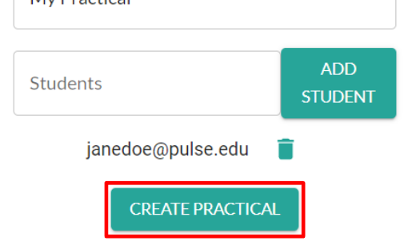

# Making a Practical (Instructor)

---

>Any Admin or Instructor of a school can make a Practical. This page is for making a Practical as an Admin.  For Instructors follow this: **[Making a Practical (Admin)](/user_guides/admin/make_practical/admin_make_practical.md)**

To Make a Practical:

1. Login to your Instructor account and navigate to **Make Practical** on the sidebar.

{width=40%}

2. **Upload your video**. Click *Choose File*, then select your video on your computer. Then click **Upload**.
>Video must be .mp4 format and less than 500mb

{width=60%}

1. Enter the **Name** of the Practical.
   
2. *(optional)* Enter the school/work email of a student into the **Students** box. 
   
   {width=50%}
   
   Then click **Add Student**. This will display that student's email below. 

   {width=50%}
   Repeat this for all students you want to add to your Practical. 

   > You can always add and remove students from a Practical on their Dashboard.

3. Click **Create Practical**
   {width=50%}