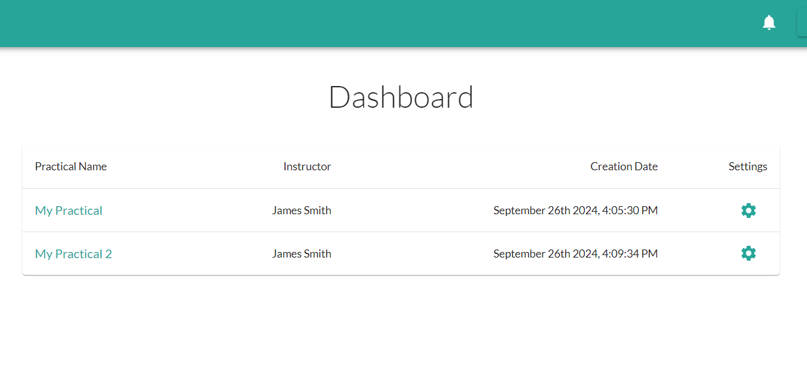
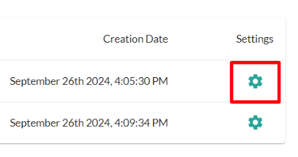
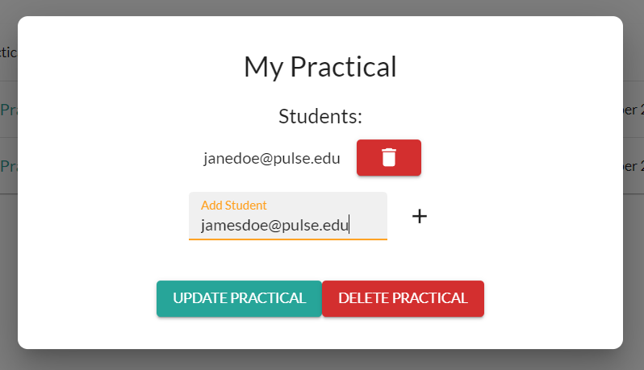
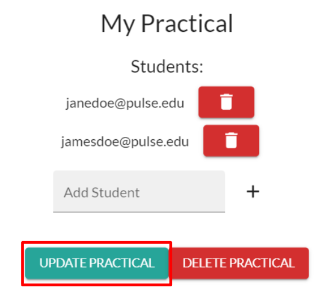
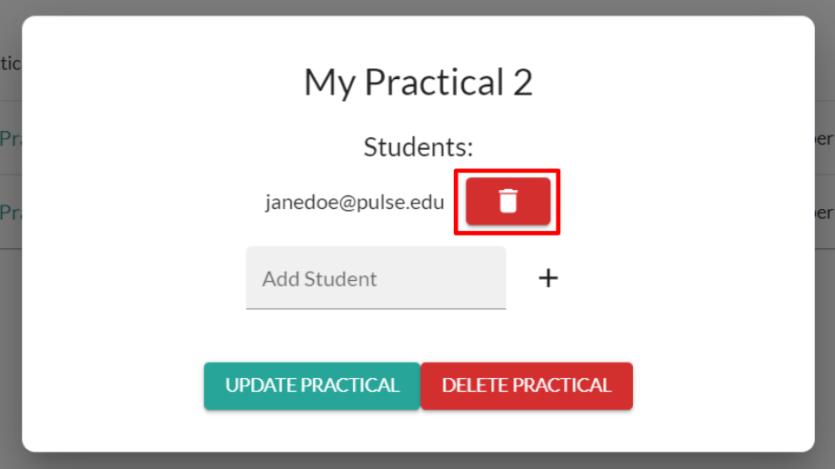
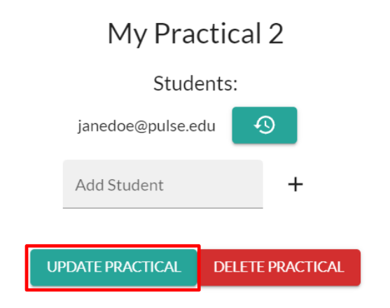
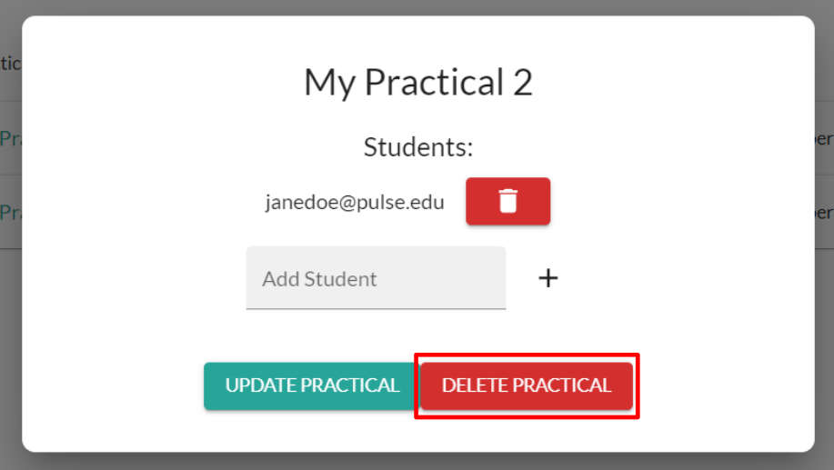

# Managing Practicals

---

In this guide:
- **Adding Students**
- **Removing Students**
- **Deleting a Practical**
---

1. Login to your Instructor account and navigate to your **Instructor Dashboard**.

1. Select the **Settings** icon for the Practical

Then on the **Practical Settings Tab** you can:
    - [Add Students](#adding-students)
    - [Remove Students](#removing-students)
    - [Deleting Practicals](#deleting-a-practical)

---

## **Adding Students**

To add additional students to a Practical:

1. Enter their school/work email into **Add Student** box.
   
2. Click the **+** Icon.
   
3. Click **Update Practical**.
   

---
## **Removing Students**

To remove students from a Practical:

1. Click the **Trash Icon** next to the student's email.
   
2. Click **Update Practical**.
   

---
## **Deleting a Practical**

Click the **Delete Practical** button.

