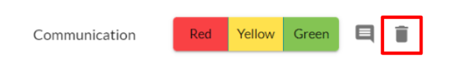
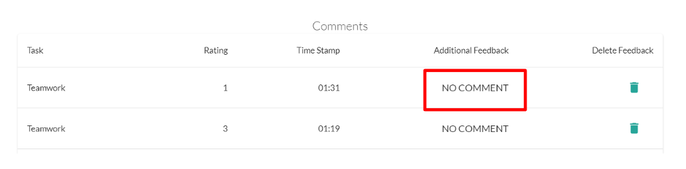
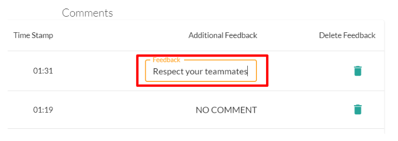
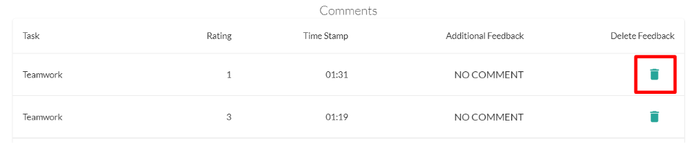
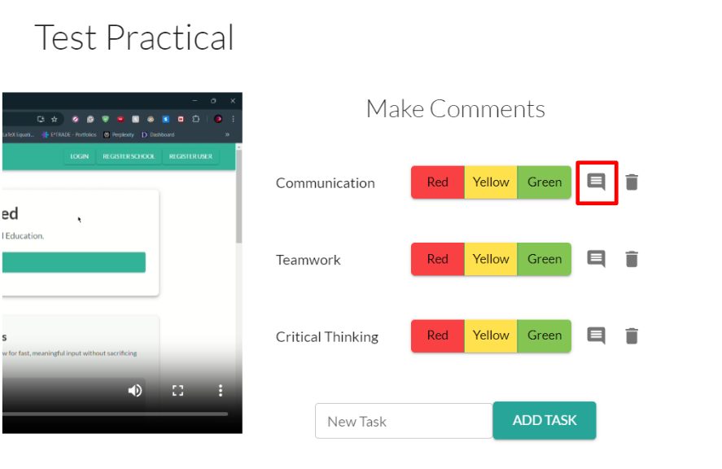
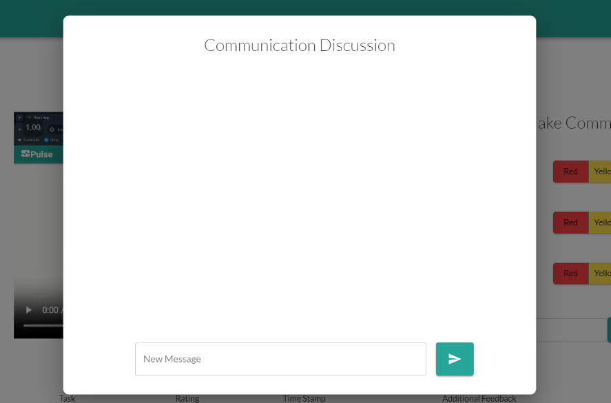
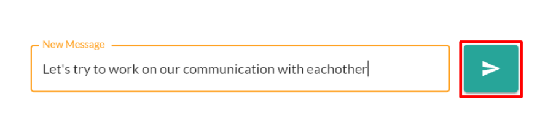
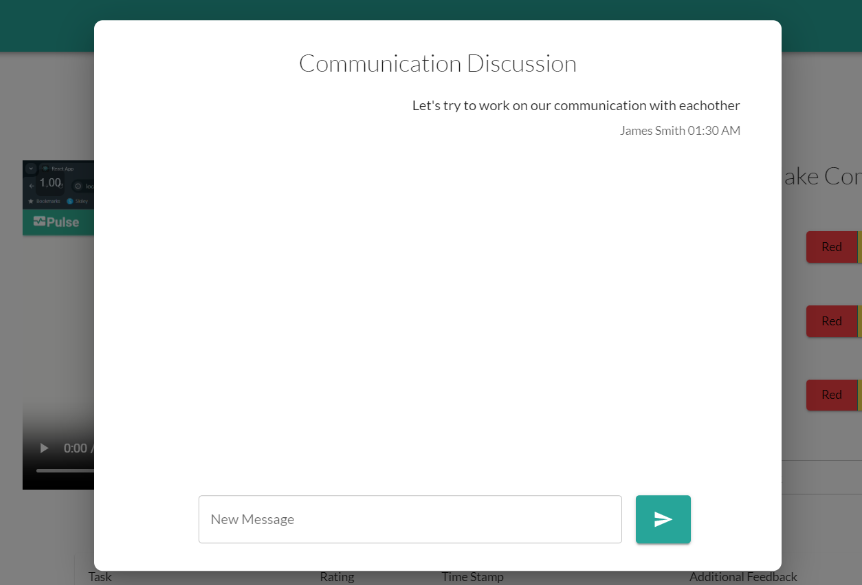

# Using a Practical (Instructor)

In this guide:
- **Making Tasks**
- **Adding Comments**
- **Adding Additional Feedback**
- **Removing Comments**
- **Using Discussions**
---

## **Making Tasks**

Before you can make comments on a Practical, you must first define the Tasks/Skills you are giving feedback on. To make new Tasks for a Practical:

1. Go to the **Make Comments** section to the right of the video.
    
2. Enter the name of the Task/Skill you want to give feedback on.
3. Click **Add Task**.
    

Now that task will appear in the **Make Comments** section as a Task you can make comments for.

*You can **Delete a Task** by clicking the **Trash Icon** next to the Task*

---

## **Adding Comments**

Now that you have tasks/skills set up on the Practical, you can add comments by clicking the **Red**, **Yellow**, or **Green** Buttons in the **Make Comments** section to the right of the video.

Clicking any of these buttons will add a comment of that rating in that task at the **current** timestamp of the video.

The comments will also appear below the video, with your most recent comments sorted at the top.

---

## **Adding Additional Feedback**

After you have made a comment for a Practical, you may add addtional feedback to that comment. 

To add additional feedback:
1. Scroll down below the video to the comment you you have previously made.
2. Click the text box under **Additional Feedback**

3. Enter additional feedback then hit **Enter**

---

## **Removing Comments**

To remove Comments:

1. Scroll down below the video to the comment you you have previously made.
2. Click the **Trash Icon** next to the comment you would like to delete

## **Using Discussions**

Each Task is automatically given its own Discussion Thread you can use to discuss that task with your students. To access and use the Discussion Thread:

1. Locate that task under the **Make Comments** section.
2. Click the **Discussion Icon** next to the task.

3. Enter the message you would like to send. Then click the **Send Icon**

