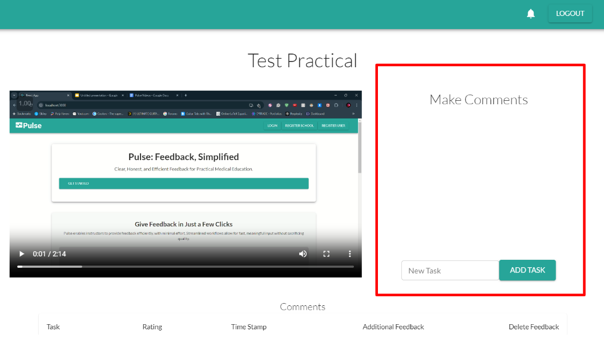
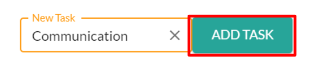
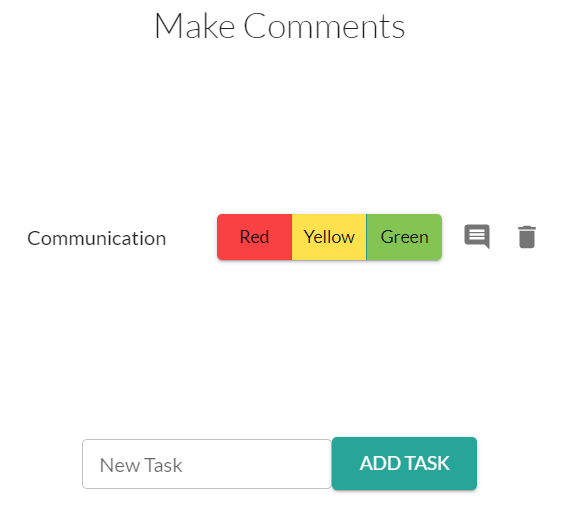
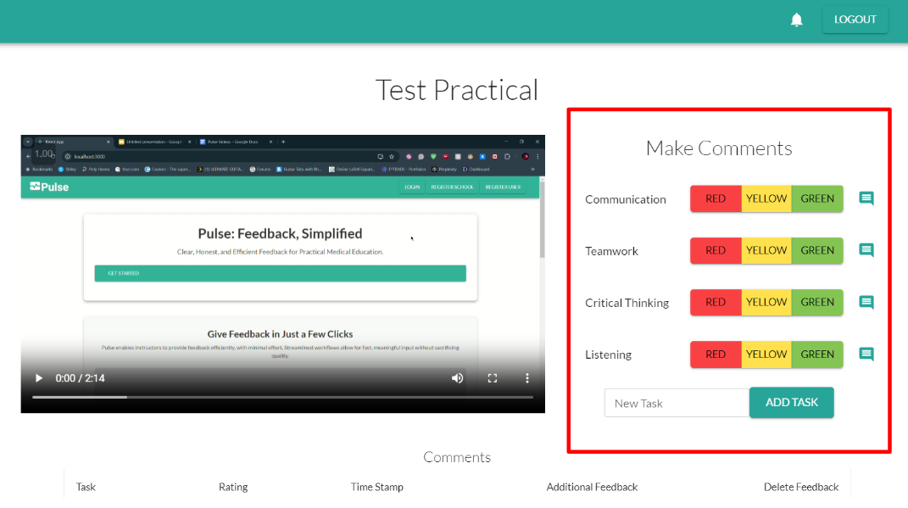

# Using a Practical (Instructor)

**In this guide:**
- Making Tasks
- Adding Comments
- Adding Additional Feedback
- Removing Comments
- Using Discussions
---

### Making Tasks

Before you can make comments on a Practical, you must first define the Tasks/Skills you are giving feedback on. To make new Tasks for a Practical:

1. Go to the **Make Comments** section to the right of the video.
    
2. Enter the name of the Task/Skill you want to give feedback on.
3. Click **Add Task**.
    

Now that task will appear in the **Make Comments** section as a Task you can make comments for.

---

### Adding Comments

Now that you have tasks/skills set up on the Practical, you can add comments by clicking the **Red**, **Yellow**, or **Green** Buttons in the **Make Comments** section to the right of the video.

Clicking any of these buttons will add a comment of that rating in that task at the **current** timestamp of the video.

The comments will also appear below the video, with your most recent comments sorted at the top.

---

### Adding Additional Feedback

After you have made a comment for a Practical, you may add addtional feedback to that comment in the form of a text. Scroll down below the video to the comment and 
1

### Removing Comments

### Using Discussions