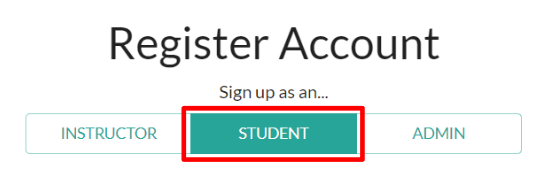
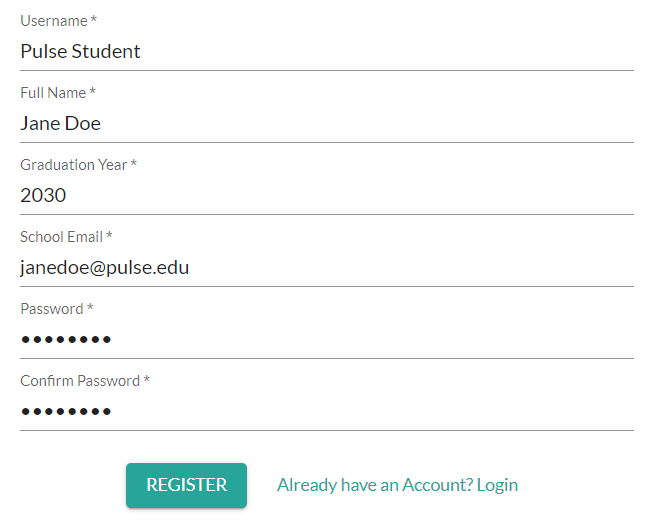

# Registering an Account (Student)

---

*To register an account as an Instructor, an admin at your school must first invite your school/work email to your school. See **[Adding Students, Instructors, and Admins to Your School](/user_guides/admin/adding_users_to_your_school/)** for more.*

From the Home Page navigate to "Register User" or follow this link: https://the-pulse-app.com/register_user.

---

1. Select "sign up as an..." **Student**

2. Enter your **Username**.
3. Enter your **Full Name**.
4. Enter your **Graduation Year**.
5. Enter your **Work/School Email Address**
6. Enter and confirm your **Password**

7. Click **Register**

