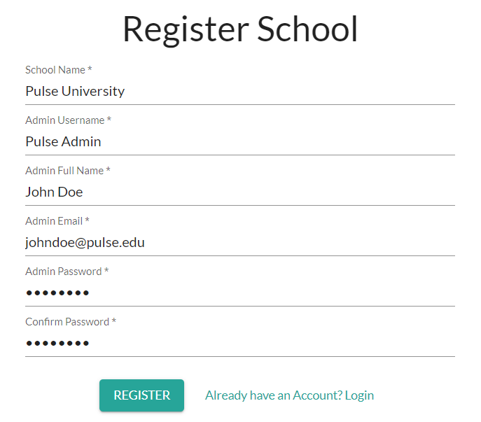

# Registering a School
---

From the Home Page navigate to "Register School" or follow this link: https://the-pulse-app.com/register_school

1. Enter your **School Name**.
2. Enter your **Admin Username**.
3. Enter your **Full Name**.
4. Enter the **Admin Work/School Email Address**
5. Enter and confirm **Admin Password**

To add instructors and students, Follow this page: **[Adding Students, Instructors, and Admins to a School](./admin_add_users.md)**